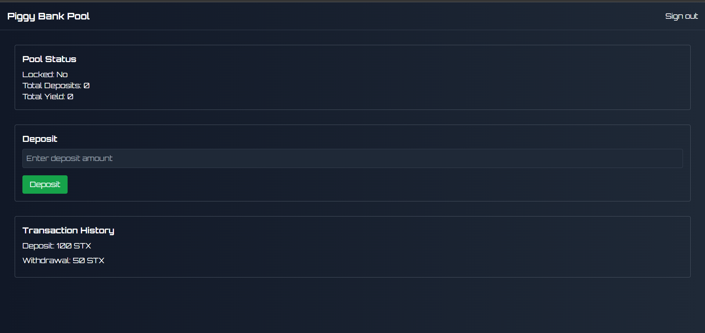

# Savings Pool with Yield Distribution



A blockchain-based savings pool on the **Stacks** blockchain that enables users to lock tokens, earn interest over time, and receive proportional yield based on their contributions. Early participants may receive bonuses, while early withdrawals incur penalties.


## Features

### 💰 Token Locking  
- Users can lock tokens for a fixed period.  
- Token locking supports early bonuses to incentivize quick participation.  
- Penalty structure for premature withdrawals.  

### 📊 Yield Distribution  
- Earn interest based on the percentage of the pool owned.  
- Real-time updates on individual shares.  
- Transparent distribution of accrued interest.  

### 🎮 Gamified Participation  
- Penalties for early withdrawals.  
- Leaderboard for top contributors.  
- Optional bonus tiers for larger or longer commitments.  

### 🔒 Security Features  
- Role-based access control for managing pool configurations.  
- Transparent transaction records on-chain.  
- Automated withdrawal validation to prevent abuse.  

## Other Features
- Users can **deposit STX** into the savings pool.
- The pool can be **locked** to prevent further deposits and withdrawals.
- **Yield** can be added to the pool by the contract owner and distributed proportionally.
- **Emergency withdrawals** are allowed with a penalty.
- Interest distribution based on users’ deposits.
---

## Getting Started

### Prerequisites  
- [Node.js](https://nodejs.org/) (v16 or higher)  
- [Clarinet](https://github.com/hirosystems/clarinet)  
- [Stacks Wallet](https://www.hiro.so/wallet)  

### Installation

1. **Clone the repository:**
   ```bash
   git clone https://github.com/yourusername/savings-pool.git
   cd savings-pool


2. Install dependencies:
```bash
npm install
```

3. Setup development environment:
```bash
clarinet integrate
```

### Running Tests

Run the test suite:
```bash
npm test
```

Run with coverage:
```bash
npm run test:coverage
```

## Usage

### Contract Deployment

1. Deploy to testnet:
```bash
clarinet deploy --testnet
```

2. Deploy to mainnet:
```bash
clarinet deploy --mainnet
```

## Contract Functions

### Depositing STX

```clarity
(contract-call? .savings-pool deposit 
    u500)         ;; amount of STX to deposit  
```

- **Description:** A user deposits a specific amount of STX into the pool.  
- **Validations:**  
  - Pool must not be locked.
  - Amount must be greater than 0 and within the allowed limit (e.g., 10,000 STX).  
- **State Changes:**  
  - Adds the deposited amount to the user’s pool balance.
  - Updates the total pool deposits.

---

### Locking the Pool

```clarity
(contract-call? .savings-pool lock-pool)
```

- **Description:** The contract owner locks the pool, preventing further deposits and withdrawals.  
- **Validations:**  
  - Only the contract owner can lock the pool.  
  - The pool must not already be locked.  
- **State Changes:**  
  - Sets the `pool-locked` variable to `true`.  
  - Records the lock start time using `block-height`.

---

### Unlocking the Pool

```clarity
(contract-call? .savings-pool unlock-pool)
```

- **Description:** The contract owner unlocks the pool, allowing deposits and withdrawals again.  
- **Validations:**  
  - Only the contract owner can unlock the pool.  
  - The pool must be locked and the lock period must have elapsed.  
- **State Changes:**  
  - Sets the `pool-locked` variable to `false`.

---

### Adding Yield

```clarity
(contract-call? .savings-pool add-yield 
    u100000)      ;; amount of yield to add  
```

- **Description:** The contract owner adds yield to the pool to distribute to participants.  
- **Validations:**  
  - Only the contract owner can add yield.  
  - Yield amount must be greater than 0.  
- **State Changes:**  
  - Updates the total yield of the pool.

---

### Emergency Withdrawal

```clarity
(contract-call? .savings-pool emergency-withdraw 
    u250)         ;; amount to withdraw in emergency  
```

- **Description:** Allows users to withdraw their funds with a penalty if needed.  
- **Validations:**  
  - User must have enough balance to withdraw the requested amount.  
- **State Changes:**  
  - Deducts the penalty from the withdrawn amount.
  - Updates the user's deposit balance.

---

### Distributing Interest

```clarity
(contract-call? .savings-pool distribute-interest 
    u100000)      ;; total interest to distribute  
```

- **Description:** Distributes interest proportionally based on users' deposits.  
- **Validations:**  
  - Only the contract owner can distribute interest.

---

## Usage Examples

Below are some example contract calls:

### Locking Tokens

```clarity
(contract-call? .savings-pool lock-tokens 
    u500          ;; amount of tokens  
    u30)          ;; lock duration in days  
```

### Withdrawing Tokens

```clarity
(contract-call? .savings-pool withdraw-tokens 
    u250)         ;; amount to withdraw  
```

### Distributing Interest

```clarity
(contract-call? .savings-pool distribute-interest 
    u100000)      ;; total interest to distribute  
```

---

## Architecture

### Smart Contract Structure

```
savings-pool/
├── contracts/
│   └── savings-pool.clar           # Main contract
│   └── enhanced-savings-pool.clar  # Advanced contract
├── tests/
│   └── savings-pool.test.ts             # Test suite
│   └── enhanced-savings-pool.test.ts    # Test suite
└── readme.md                            # Documentation
```